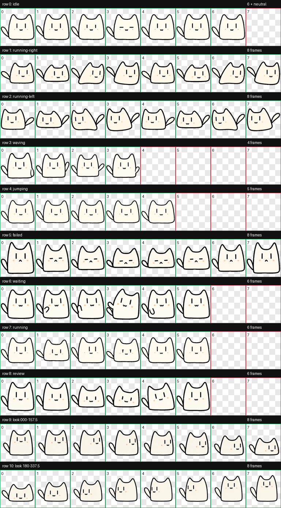
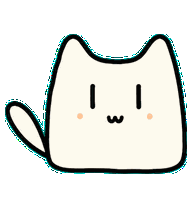
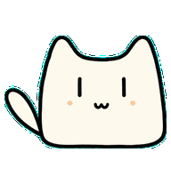
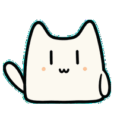
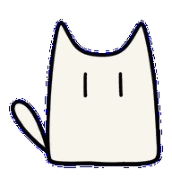
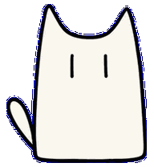

# Sketchcat for Codex



Sketchcat is an unofficial custom animated pet for the Codex desktop app. It is based on Lynn's original minimalist hand-drawn cat, refined with a shorter rounded body, softer upright ears, a tiny smile, subtle peach cheeks, and an expressive attached tail.

This package uses the Codex v2 pet format:

- 8 columns × 11 rows
- 192 × 208 pixels per animation cell
- 1536 × 2288 pixel WebP spritesheet
- Nine standard animation states
- Sixteen clockwise look directions

## Install

### Windows

1. Download the repository as a ZIP and extract it.
2. Completely quit Codex.
3. Copy the entire repository folder to:

   ```text
   C:\Users\YOUR_NAME\.codex\pets\sketchcat
   ```

4. Confirm that these files exist:

   ```text
   C:\Users\YOUR_NAME\.codex\pets\sketchcat\pet.json
   C:\Users\YOUR_NAME\.codex\pets\sketchcat\spritesheet.webp
   ```

5. Reopen Codex and select **Sketchcat** in the pet selector.

### macOS and Linux

Copy the repository folder to:

```text
~/.codex/pets/sketchcat
```

Then restart Codex and select **Sketchcat**.

## Animation preview

| Idle | Jumping | Waving |
| --- | --- | --- |
|  |  |  |

| Running right | Waiting | Failed |
| --- | --- | --- |
|  |  |  |

The complete atlas layout and direction mapping are documented in [Animation specification](docs/ANIMATION_SPEC.md).

## Design details

- Flat 2D hand-drawn line art; no realistic or 3D treatment
- No separate legs or feet
- Down-looking poses shorten the whole silhouette
- Both ears remain upright during the failed animation
- Jumping begins smoothly without an initial size pop

## Package contents

```text
sketchcat/
├── pet.json
├── spritesheet.webp
├── README.md
├── CHANGELOG.md
├── COPYRIGHT.md
├── assets/
│   ├── contact-sheet.png
│   ├── look-directions.png
│   └── previews/
└── docs/
    └── ANIMATION_SPEC.md
```

Only `pet.json` and `spritesheet.webp` are required for installation. The other files document and preview the pet.

## Compatibility note

The floating-pet drag behavior is controlled by the Codex desktop app rather than this spritesheet. On some app versions, only part of the floating pet may initiate dragging; the same behavior can affect built-in pets.

## License

Sketchcat is licensed under [Creative Commons Attribution-NonCommercial 4.0 International](LICENSE) (**CC BY-NC 4.0**). You may share and modify it with appropriate attribution, but commercial use is not permitted. Modified versions must clearly indicate that changes were made.

The designated public attribution name is **Lynn**.

This is a community-created pet and is not an official OpenAI or Codex asset.

---
