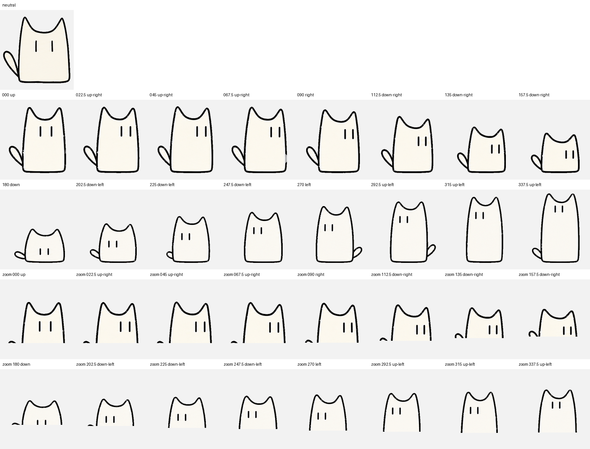

# Animation specification

Sketchcat follows the Codex v2 animated-pet atlas contract.

## Atlas geometry

| Property | Value |
| --- | ---: |
| Columns | 8 |
| Rows | 11 |
| Cell width | 192 px |
| Cell height | 208 px |
| Atlas width | 1536 px |
| Atlas height | 2288 px |
| Sprite version | 2 |

The manifest declares the format through:

```json
{
  "spriteVersionNumber": 2,
  "spritesheetPath": "spritesheet.webp"
}
```

## Standard animation rows

| Row | State | Used frames |
| ---: | --- | ---: |
| 0 | Idle | 6 |
| 1 | Running right | 8 |
| 2 | Running left | 8 |
| 3 | Waving | 4 |
| 4 | Jumping | 5 |
| 5 | Failed | 8 |
| 6 | Waiting | 6 |
| 7 | Running | 6 |
| 8 | Review | 6 |

Unused cells remain transparent.

## Look directions

Rows 9 and 10 contain sixteen clockwise gaze directions in 22.5-degree steps:

```text
000, 022.5, 045, 067.5, 090, 112.5, 135, 157.5,
180, 202.5, 225, 247.5, 270, 292.5, 315, 337.5
```

The down-looking poses progressively shorten the cat's complete body while retaining its planted baseline. The failed animation keeps both ears upright, and the directional running animations intentionally contain no separate legs.



## Validation

The distributed spritesheet was validated as an RGBA WebP at 1536 × 2288 pixels with no opaque chroma-key pixels, no chroma fringe, and no transparent RGB residue.
